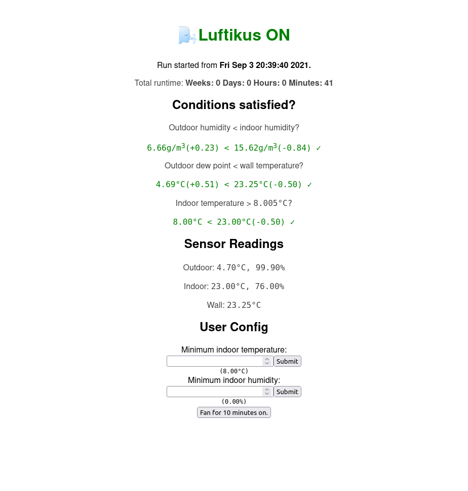
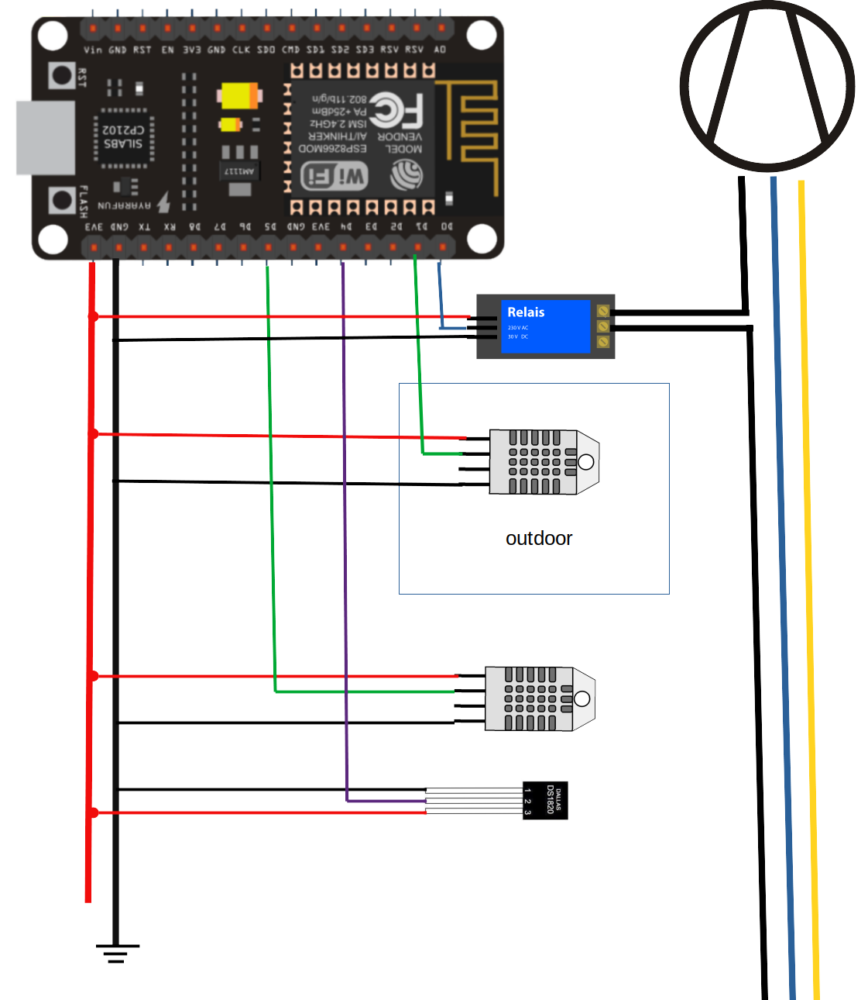

# LuftiKus
**Lu**ft**f**euch**t**igkeits opt**i**mierte **K**ellerlüft**u**ngs**s**teuerung


This is an ESP8266-board based ventilation controlling system for reducing humidity of a cellar by only venting if the outdoor air is dryer than the indoor air.

To build it one needs:

- 1x ESP8266 ESP-12E CH340G Board
- 2x DHT22 Sensors
- 1x DS18B20 Sensors
- 1x Relay or MOSFET
- 1x USB-b cable and charger
- 1x case for the outdoor DHT22


As a relay one can use a

*"Raspberry Pi" 5V/230V 1-CH Relay*.

In case, you do not trust these cheap relays,
you can use a *MOSFET* (e.g. *IRF520*) with some (12V) DC-source
to switch some mono-stable relay.
This also works if you want to directly switch the power of your DC-fan.

## How to flash

Connect the board via the USB-port to your computer.
You can flash the [firware.bin](.pio/build/nodemcuv2/firmware.bin) using esp-tool:

```bash
esptool  write_flash -fm dio 0x00000 firmware.bin
```

Or you use a GUI for the esptool:  
https://github.com/Grovkillen/ESP_Easy_Flasher  
https://github.com/marcelstoer/nodemcu-pyflasher

## How to setup

Power up the board after flashing.

Connect your phone/computer to the WiFi-Access-point *Luftikus-Setup-AP*. Then go to the website http://192.168.4.1 and put in your WiFi credentials.

The board should restart and connect itself to your Wifi.
Now you can visit its website (only http:// no https://) on your WiFi.
It will broadcast its IP on startup via the serial port
or you look into your WiFi-router-config for the IP.




## How to develop

Use Platformio.




## Missing features
- MQTT sensor value broadcast
- No-WiFi-setup
- Logging with download
- Other smart-home connections!?
- BME280 support
